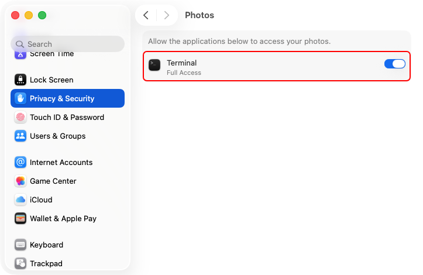

# 宽云®️ Apple 照片大文件查找器

宽云®️ Apple 照片大文件查找器可在 macOS 的“照片”应用中查找和管理大文件。

> 支持 iCloud 照片和**优化 Mac 储存空间**。

与传统的磁盘扫描工具不同，本项目使用 Apple 官方的 **PhotoKit** 框架，直接从照片图库数据库读取元数据，而不是枚举本地文件。因此，即使原始文件仅存储在 iCloud 中，本工具也能正确分析相关资源。

---

## 截图

### 自动将最大的资源标记到专用相簿中


检测到 Apple 照片图库中最大的资源后，程序会自动将它们加入 `LargeFileFinder` 相簿。

---

## 项目结构

```text
py-apple-photos-large-file-finder/
├── images/
│   ├── photos-large_file_finder.png
│   ├── privacy-security-photos.png
│   └── privacy-security-photos-terminal.png
│
├── src/
│   ├── large_files_tag_to_album.py
│   └── large_files_export_to_csv.py
│
├── README.md
└── LICENSE
```

---

## 功能特性

- 直接分析 Apple“照片”应用中的资源
- 支持 iCloud 照片
- 兼容**优化 Mac 储存空间**
- 检测大尺寸照片和视频
- 自动将大文件资源标记到专用相簿中
- 将大文件资源的元数据导出为 CSV
- 支持实况照片、RAW、HEIF、视频和编辑后的资源
- 无需扫描文件系统
- 避免重复标记相簿中的资源
- 适用于超大型照片图库

---

## 系统要求

- 建议使用 macOS 13 或更高版本
- Apple 芯片或 Intel 芯片的 Mac
- Python 3.11 或更高版本
- Apple“照片”应用
- 照片图库必须配置为**系统照片图库**

---

## 安装

克隆仓库：

```bash
git clone https://github.com/dekuan/py-apple-photos-large-file-finder.git

cd py-apple-photos-large-file-finder
```

安装依赖：

```bash
python3 -m pip install -U pyobjc
```

或者仅安装所需框架：

```bash
python3 -m pip install pyobjc-framework-Photos pyobjc-framework-Cocoa
```

---

# macOS 权限

macOS 要求用户明确授权访问照片图库。如果没有相应权限，脚本可能返回零个资源。

---

## 第 1 步——打开照片权限设置

打开：

```text
系统设置 → 隐私与安全性 → 照片
```


---

## 第 2 步——授予终端或 IDE 完全访问权限

为你使用的终端或 IDE 启用访问权限：

- 终端
- iTerm2
- VS Code
- PyCharm
- 其他工具



---

## 第 3 步——确保该照片图库是系统照片图库

打开：

```text
“照片”应用 → 设置 → 通用 → 用作系统照片图库
```

> ⚠️ 如果没有“照片”的完全访问权限，标记或导出资源可能失败。

---

# 脚本与用法

## 1️⃣ 将最大文件标记到专用相簿中

**文件：**

```text
src/large_files_tag_to_album.py
```

查找照片图库中最大的 1000 个资源，并将它们标记到名为 `LargeFileFinder` 的专用相簿中。

程序会自动跳过已经标记的资源，以避免重复添加。

---

### 运行

```bash
python3 src/large_files_tag_to_album.py
```

---

### 实际输出示例

```text
Reading Photos assets...
Found 168303 assets in the Photos library.
Processed 1000/168303 assets...
Processed 2000/168303 assets...
...
Processed 167000/168303 assets...
Processed 168000/168303 assets...

Top 1000 largest assets:
   1.   13.68 GB  ScreenRecording_12-08-2024 21-51-06_1.mp4
   2.   11.84 GB  VID_20241006_202959.mp4
   3.   11.73 GB  RPReplay_Final1696922715.MP4
   ...
  19.    6.62 GB  RPReplay_Final1697954875-2.MP4
  20.    6.51 GB  RPReplay_Final1700027646.MP4

Adding assets to album: LargeFileFinder
No new assets to add. Album already contains these assets: LargeFileFinder

Done.
```

---

## 2️⃣ 将最大文件的元数据导出为 CSV

**文件：**

```text
src/large_files_export_to_csv.py
```

查找照片图库中最大的 1000 个资源，并将其元数据导出到以下 CSV 文件：

```text
largest_photos.csv
```

---

### 运行

```bash
python3 src/large_files_export_to_csv.py
```

---

### 实际输出示例

```text
Reading Photos assets...
Found 168303 assets in the Photos library.
Processed 1000/168303 assets...
Processed 2000/168303 assets...
...
Processed 166000/168303 assets...
Processed 168000/168303 assets...
Sorting assets by size...
Writing to CSV file...

Top largest assets:

   1.   13.68 GB  ScreenRecording_12-08-2024 21-51-06_1.mp4
   2.   11.84 GB  VID_20241006_202959.mp4
   3.   11.73 GB  RPReplay_Final1696922715.MP4
   5.   10.63 GB  RPReplay_Final1722636238-1.mov
   ...
  20.    6.51 GB  RPReplay_Final1700027646.MP4

Done!
CSV file created: largest_photos.csv
```

---

### CSV 列

| 字段       | 说明                 |
| ---------- | -------------------- |
| size_bytes | 以字节表示的原始大小 |
| size_human | 便于阅读的文件大小   |
| filename   | 原始文件名           |
| width      | 资源宽度             |
| height     | 资源高度             |
| duration   | 视频时长（秒）       |
| created    | 创建日期             |
| id         | 照片资源标识符       |

---

## 快速用法摘要

```bash
# 将最大的文件标记到专用相簿中
python3 src/large_files_tag_to_album.py

# 将最大文件的元数据导出为 CSV
python3 src/large_files_export_to_csv.py
```

> 两个脚本默认都处理最大的 1000 个资源。如有需要，可以调整各脚本中的 `LIMIT` 常量。

---

## 技术说明

- 通过 PyObjC 桥接使用 **PhotoKit**（`PHAsset` 和 `PHAssetResource`）
- 使用以下方式获取文件大小：

```python
resource.valueForKey_("fileSize")
```

Apple 未提供用于获取资源文件大小的公开 API，尤其是由 iCloud 管理的资源。

这种基于 KVC 的方法已被 macOS 开发者广泛使用，并且在现代 macOS 版本中运行可靠。

---

## 局限性

- 处理超大型图库可能需要几分钟
- 获取文件大小依赖未公开的 KVC 访问方式
- 未来的 macOS 更新可能改变 PhotoKit 的行为
- 仅存储在 iCloud 中的资源可能只返回部分元数据

---

## 未来计划

- 原生 macOS 图形界面应用
- 重复资源检测
- 实况照片分析
- HEIF / RAW 分析
- 高级筛选
- 储存空间可视化
- 智能清理工作流

---

## 许可证

MIT 许可证

---

## 免责声明与商标说明

本项目与 Apple Inc. 没有关联。

Apple Photos、PhotoKit、macOS 和 iCloud 是 Apple Inc. 的商标。

宽云®️是其权利人的注册商标。本项目以“宽云®️ Apple 照片大文件查找器”名称提供相关软件功能与说明。
